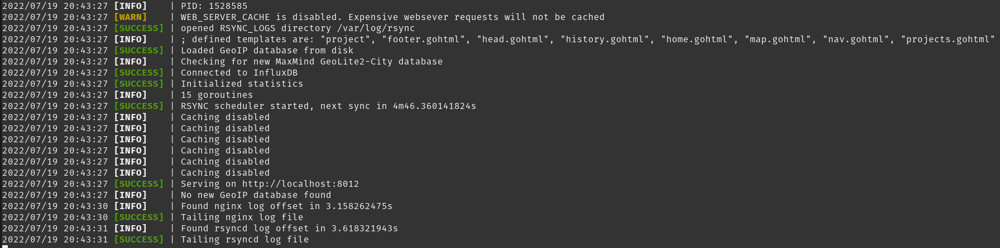

# logging

This module provides thread-safe logging as a part of our [Mirror](https://github.com/COSI-Lab/Mirror) project.



There are plenty of low-priority improvements that can be made to this module.

## Usage

```text
go get "github.com/COSI-Lab/logging"
```

Example:

```go
package main

import (
    "github.com/COSI-Lab/logging"
)

func main() {
    logging.Info("Hello, world!")
    logging.Warn("Warning world didn't say hello back!")
    logging.Error("Error world is broken!")
}
```
